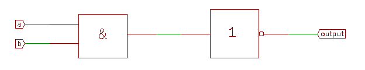

# Disimpy introduction

Disimpy is a Python library for the definition
and simulation of digital circuits.

[pdf version](https://gitprint.com/wovo/disimpy/blob/master/documentation/introduction.md)

*****************************************************************************

## Content

<!-- update table_of_contents( input, 3 ) -->

  - [Disimpy introduction](#toc-anchor-0)

    - [1. Simple combinatorial circuits](#toc-anchor-1)

    - [2. Named inputs and outputs: busses](#toc-anchor-2)

    - [3. Multi-wire inputs and outputs](#toc-anchor-3)

    - [4. Built-in logic operators and functions](#toc-anchor-4)

    - [5. Building an ALU](#toc-anchor-5)

<!-- update end -->

<!-- update example_path( "sources/introduction.py" ) -->

*****************************************************************************

## 1. Simple combinatorial circuits

In dimspy a circuit is created by a function that takes the inputs
of the circuit as parameters, and returns the output(s) of the circuit.
Such a *circuit function* does not *calculate* the output,
instead it *creates (and returns) a circuit*.
That circuit can be used to calculate the output for a given
set of input values.

Circuit functions for the basic gates (or, and, xor, not) are available 
as overloads of the bitwise logic operators (&,|,^,~).
These functions operate on a single wires (single logical value, 0 or 1).

In this my_nand_gate() function the created circuit consists of two
basic gates, an *and* and a *not*, and 
the created circuit calculates the *nand* function.

<!-- update quote( input, "", "''my_nand_gate''" ) -->
~~~Python
def my_nand_gate( a, b ):
    return ~ ( a & b )
~~~

To test a circuit function, it must first be used to create a circuit.
For the my_nand_gate() function this creates a circuit that has two 
inputs named a and b, and a single output.
The input values of this circuit can be assigned a value
by assigning to the attributes, or
by calling the set method with keyword parameters.
When the inputs are set, the output value can be retrived by a value() call.

<!-- update quote( input, "", "''my_nand_gate test''" ) -->
~~~Python
my_nand_circuit = disimpy.circuit( my_nand_gate )

my_nand_circuit.a, my_nand_circuit.b = 0, 1
print( "nand( 0, 1 ) =>", c.value() )

my_nand_circuit.set( a = 1, b = 1 )
print( "nand( 1, 1 ) =>", c.value() )
~~~

<print>

The function truth_table() returns a table that shows the output(s)
of a circuit function for all possible inputs.

<!-- update quote( input, "", "''my_nand_gate truth table''" ) -->
~~~Python
print( disimpy.truth_table( my_nand_gate ))
~~~

<print>

The xor is available as a basic gate, 
but it could be defined as the classic xor-from-nands,
using the my_nand_gate() circuit function as building block.

<!-- update quote( input, "", "''my_xor_gate 1''" ) -->
~~~Python
def my_xor_gate( a, b ):
    return my_nand_gate( 
        my_nand_gate( a, my_nand_gate( a, b ) )
        my_nand_gate( b, my_nand_gate( a, b ) )
    )    
~~~

This is correct, but it uses five calls to my_nands_gate(),
because the expression my_nand_gate( a, b ) is used twice.
To prevent this, a local variable can be used 
to re-use the output of the sub-circuit my_nand_gate( a, b ).

<!-- update quote( input, "", "''my_xor_gate 2''" ) -->
~~~Python
def my_xor_gate( a, b ):
    nand_ab = my_nand_gate( a, b )
    return my_nand_gate( 
       my_nand_gate( a, nand_ab )
       my_nand_gate( b, nand_ab )
    )        
~~~	
    

*****************************************************************************

## 2. Named inputs and outputs: busses

A circuit that has named outputs is called a bus. 
It is created by a call to the bus function.
The outputs are available as attributes of the bus.

This half-adder() circuit function has two input wires, 
and two named outputs *sum* and *carry*.

<!-- update quote( input, "", "''half_adder''" ) -->
~~~Python
def half_adder( a, b ):
    return disimpy.bus(
       sum = a ^ b
       carry = a & b 
    )
~~~	

This full_adder() circuit uses two half-adders to create a full adder. 
It has three equivalent inputs (it doesn't matter which is used
as normal input or carry), and two named outputs *sum* and *carry*.

<!-- update quote( input, "", "''full_adder''" ) -->
~~~Python   
def full_adder( a, b, c ):
    bc = half_adder( b, bc )
    abc = half_adder( a, bc.sum )
    return disimpy.bus(
        sum = abc.sum, 
        carry = ab.carry | abc.carry 
    )    
~~~

*****************************************************************************

## 3. Multi-wire inputs and outputs

A circuit function can accept multiple input wires
as a Python sequence.

This my_nor_gate() circuit function uses reduce() to apply 
the or operator | to all elements of the sequence, 
and applying the not operator ~ to the result.
Reduce requires a function (not an operator) as its first parameter, so 
a lambda is used to create a function from the | operator.

<!-- update quote( input, "", "''my_nor_gate''" ) -->
~~~Python
def my_nor_gate( port ):
    return ~ reduce( lambda a, b : a | b, port )
~~~	
   
When such a function is used, either to create a circuit
or in a call to truth_table(), the number 
of inputs in the port must be specified. 
This can be done via a keyword parameter to the circuit() 
or truth_table() function calls, with the same name as the port.

<!-- update quote( input, "", "''my_nor_gate test 1''" ) -->
~~~Python
my_nor_circuit = disimpy.circuit( my_nor_gate, inputs = 3 )    
print( disimpy.truth_table( my_nor_gate, inputs = 3 ))
~~~

<<print>>

The truth_table function can also be called with a circuit
(instead of a circuit function).

<!-- update quote( input, "", "''my_nor_gate test''" ) -->
~~~Python
print( disimpy.truth_table( my_nor_circuit ))
~~~
    
A circuit function can be used as a building block 
for functions that create more complex circuits. 

A usefull pattern is to combine a single wire
with each of the wires in a sequence.

This my_nand_for_port_and_wire() function uses list comprehension 
to apply *a* to each of the wires in *b*, and return the result as a list.

<!-- update quote( input, "", "''my_nand_for_port_and_wire''" ) -->
~~~Python
def my_nand_for_port_and_wire( a, b ):
    return [ ~ ( x & b ) for x in a ]    
~~~

Another usefull pattern is to apply a logic gate to two 
same-length sequences of wires, yielding a sequence of the gates outputs 's 
for pairs of wires from the two input sequences.

This my_xor_for_two_ports() function uses zip() to create a 
sequence of pairs of wires from the two 
(presumably same-length) sequences of wires, 
and produces a list of the xor's of the pairs of wires.

<!-- update quote( input, "", "''my_xor_for_two_ports 2''" ) -->
~~~Python
def my_xor_for_two_ports( a, b ):
    return [ x ^ y for x, y in zip( a, b ) ]
~~~

The my_xor_for_two_ports() can be used to check whether the binary values
in two ports are equal: this requires that the outputs are all zero,
which is exactly the nor function.

<!-- update quote( input, "", "''equal''" ) -->
~~~Python
def equal( a, b ):
    return my_nor_gate( my_xor_for_two_ports( a, b ))
~~~

*****************************************************************************

## 4. Built-in logic operators and functions
       
The disimpy built-in logical operators (&,|,^,~) 
work (only) on single wires, and have only the 'true output' form 
(| is *or*, a *nor* must be created from ~ and |).

The full set of basic logic gates is available as disimpy functions
both with true and inverted outputs. 
The functions are more flexible in the inputs that are accepted 
than the operators.

The disimpy *and*, *nand*, *or*, *nor*, *xor* and *xnor* functions
can operate on:
   - two wires, returning a wire
   - a sequence of wires, returning a wire
   - two sequences of wires of the same length, 
        returning a sequence of wires of that same length
   - a bus and a wire, returning a bus with the same attributes
   - two busses with the same attributes, 
        returning a bus with those same attributes
		
The *not* function can operate on
   - a single wire, returning a single wire
   - a sequence of wires,
     returning a sequence of wires of that same length
   - a bus, returning a bus with the same attributes
   
For an *xor* or *xnor* with more than two inputs the 
'odd parity' definition is used (not the 'exactly one' definition).

*****************************************************************************

## 5. Building an ALU

An Arithmetic and Logic Unit (ALU) is the part of a 
Central Processing Unit (CPU) that can calculate different functions
of (in most cases) two input values.

A typical ALU has
   - two input ports that provides the input values for the calculation
   - one port bus that delivers the result of the calculation
   - a function port that selects the function that is calulated
   - a single carry input that can be considered an additional input
     for some functions
   - a port with a few status outputs that delivers additional information
     about the calulation (typically whether the result is positive,
     zero, or negative, and whether a carry/borrow occurred)

ALU functions can be partitioned in (bitwise) logical functions and
arithmetic functions. Logical functions are the traditional functions
of 2 inputs, with true or inverted output. These functions are
available as disimpy built-in functions, or can be realized via
single gates and list comprehension.

The next circuit 'meta' function calculated the bit-wise result of the
logical function f.

<!-- update quote( input, "", "''meta_gate''" ) -->
~~~Python
def meta_gate( port1, port2, f ):
    return [ f( x, y ) for x, y in zip( port1, port2 ) ]
~~~	

Arithmetic functions are more complex because they can't be done
bit-wise. The typical example is addition, where the value of each
bit depends on the two input bits *and on the carry from the lower bits*.

This ripple_addder() function adds the values on two input ports plus
one carry input. 
Each bit pair from the inputs plus a carry is added using a full_adder().
This must be done in an explicit loop (instead of by list comprehension)
because the carry-in of each stage is het carry-out of the previous one.

<!-- update quote( input, "", "''ripple_adder''" ) -->
~~~Python
def ripple_adder( port1, port2, cin ):
   result = []
   for a, b in zip( port1, port2 ):
      stage = full_adder( a, b, cin )
      result.append( stage.sum )
      cin = stage.carry
   return bus( sum = result, carry = cin ) 

~~~   

This implementation of addition is called a ripple adder because the
carry ripples through all full adders.
This makes a ripple adder slow.
Faster implementations exists, but they use more logic.

A simple implementation of an ALU calculates all supported functions
of the input values in parallel, and passes the function input 
to a selector that selects the value corresponding to the specified function.

The basis of a selector is an is_equal() circuit that checks whether an
input port has a specified literal (fixed) value.
A naive implementation would compare each wire in the port to
the corresponding bit of the fixed value, using an xor gate, and
combine the outputs of all xors with a nor.
The helper function bits( v, n ) returns the value v
as a list of n bits, lowest bit first.

~~~Python
def bits( v, n ):
   return [] if n == 0 else [ v % 2 ] + bits( v // 2, n - 1 )
   
# naive version
def is_equal( port, v ):
   return nor( [ b ^ in zip( port, bits( v, len( port ) ) ] )
~~~~

The naive is_equal() implementation can be improved by supplying
both the bus and the bitwise inverted bus.
For each bit, either the true or the inverted version is 
fed to an *and* gate.

~~~Python
def is_equal( port, port_, v )
    return and( [
        w if b else b_
           for w, b, b_ in zip( port, port_, bits( v, len( port ))) 
    ] )
~~~

The next step is a decoder: a circuit with an n bit input port,
and a 2 ** n output port, of which always exactly one bit 
corresponding to the binary value of the input port is 1
(the others are 0).

~~~Python
def decoder( v ):
   v_ = disimpy.not( v )
   return [ is_equal( v, v_, i ) for i in range( 0, 2 ** v ) ]
~~~

With a decoder() function in place a select() function that 
passes the value on the selected input port through to the output is
not complex.
The b parameter must be a sequence of bits in which only
the n'th bit is 1.
The zip( *ports ) returns a sequence in which the 
first element is a sequence of the first wires from all the ports,
the second element is a sequence of the second wires from all the ports, etc.
The *and( bits, p ) ands the bits from each port with the corresponding
bit from b. The one bit from b that is true selects the value from that port,
the values from the other ports are suppressed.
The or combines the output of the ands.

~~~Python
def select( b, ports ):
   return [ or( and( bits, p )) in zip( *ports ) ]
~~~

~~~Python
def alu( f, port1, port2, cin ):
   f_sum = ripple_adder( port1, port2, cin )
   f_and = 
   f_or
   f_xorb 
   return bus
~~~

- selector
- invert @ start / @ end

- circuit functions are nouns
- port has lowest bit first
- v_ convention